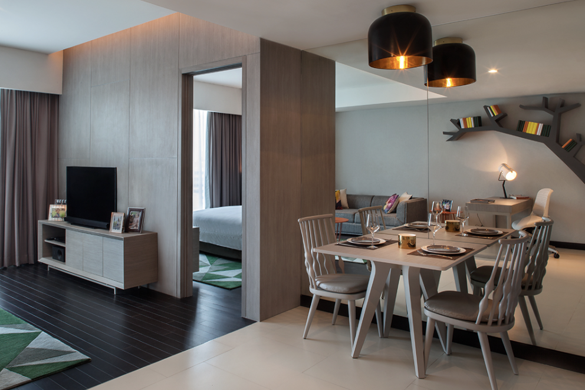

# 🏠 Tentrem Residence : Property Website

Selamat datang di Tentrem Residence:

## 📄 Pages

### 📝 About
- **Why Our Property is Different**: 
  - Halaman ini menjelaskan bagaimana akomodasi di Tentrem Residence berbeda dengan kos ataupun apartemen pada umumnya.
  
### 🏙️ Properties
- **List of Properties in Jakarta**:
  - Halaman ini berisi daftar akomodasi Tentrem Residence di penjuru Jakarta .
  

### 🏡 Rent
- **Submit a Request to Rent**: 
  - Halaman ini berfungsi untuk mengajukan sewa dengan minimum 3 bulan di Tentrem Residence. Detail informasi yang dibutuhkan adalah :
    - **📇 Contact Information**: An input field for your contact details.
    - **📍 Preferred Area**: Daerah preferensi di Jakarta agar dapat dicarikan akomodasi yang sesuai.
    - **🕰️ Duration**: Radio buttons untuk memilih durasi sewa (3 dan 6 bulan, dan 1 tahun).
    - **🕰️ Rent Start Date**: Tanggal mulai sewa.
    - **🏢 Property Type**: Dropdown untuk preferensi apakah ingin akomodasi 1BR atau 2 BR.
    - **🚀 Submit Button**: A button to submit your rental request.

## 🧭 Navigation
- Website ini berisi halaman navigasi ke **About**, **Properties**, dan **Rent**.

### Example Navigation:
- **About**: `index.html`
- **Properties**: `properties.html`
- **Rent**: `rent.html`
https://revou-fsse-5.github.io/module-1-frsnaufal10/
Website ini didesain sesimpel mungkin sehingga dapat pengguna dapat mencari informasi penting mengenai akomodasi kami dengan mudah dan mencari akomodasi di daerah yang diinginkan
